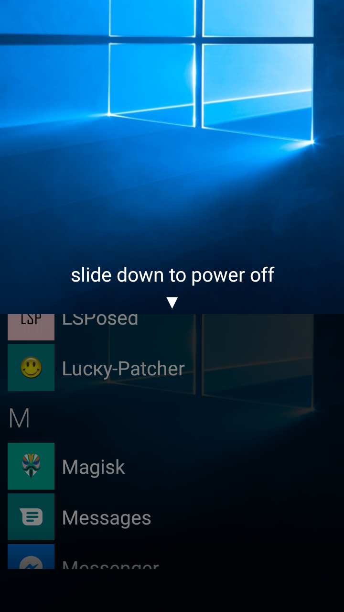

# SlideToShutDown.Xposed

Missing your old Windows Phone? Longing for a taste of your old Lumia?  
This module replaces your Android Power Menu with the Windows 10 Mobile "Slide down to power off" screen!  

## Requirements:  
- Any Xposed distribution (Pure Xposed, LSPosed, EdXposed,...)
- Root (For Xamarin Library loading)
- SlideToShutDown app, for the main slider functionality (This component was included in the module for the first
builds, however, somehow the hooked method fails to launch the activity properly without crashing SystemUI).

## Features:  
- Automatically load your lock screen wallpapers.  
- Android 11 zooming implemented.
- Replaces your Power Menu when the Power Button is long pressed!

## Bugs:
- Unstable. Sometimes may unintentionally show default Power dialog.
- Slow. Again, Xposed for Xamarin is still slow.
- Tested only on Android 11. Older (and the newer Android 12) versions of Android may require hooking other methods.

This project is also a demo of:
# XamarinPosed

Write Xposed module with Xamarin and C# 🐱‍💻

This project is still in development, but it works - you can try it now!  

~~I only test it on VirtualXposed. If it won't work on Xposed, please help me fix it.~~
Tested and working on LSPosed. Untested on VirtualXposed (VirtualXposed does not work on my phone).

## Limitations

~~The module app will be unable to open directly after you enable it as a Xposed module.~~   
~~That's because the same native libraries are already loaded by the module's ClassLoader, so the APK's ClassLoader won't be able to use them.~~  
~~Still looking for a solution.~~  
Fixed by trungnt2910.  

The Xposed hook seems to be unable to start the module app's activities without crashing
the host process. To start activities, you MUST use a supporting package.  

The app startup time would be slightly longer because of mono initialization. But hey, who cares? Welcome to the .NET world.  

## Related Projects  

[Xamarin.Android.Xposed](https://github.com/Redth/Xamarin.Android.Xposed)

This project is a good start for research, however it won't work, since it only get over the very first problem - Jar Binding.

There is still a lot of work to do after that, as you can learn from XamarinPosed.

## License

XamarinPosed is licensed under **MIT** license.

------

by Ulysses (wdwxy12345@gmail.com)
